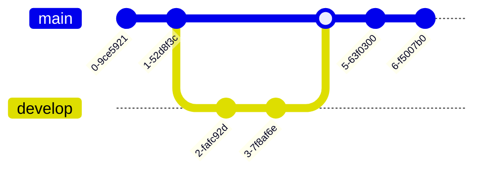

# miPrimerRepo

Mi primer repositorio. Cool!

Mi primera contribucion local para GitHub.

Un commit mas desde GitHub.

Una actualizacion mas

Cambios desde mi rama local, llamada developer01

```mermaid
gitGraph
    commit
    commit
    branch develop
    checkout develop
    commit
    commit
    checkout main
    merge develop
    commit
    commit
```
